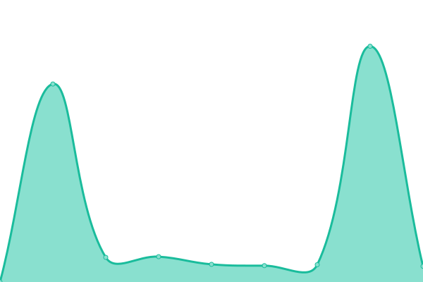
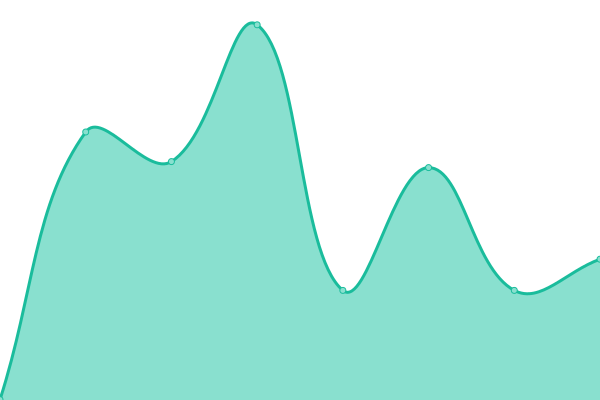

# [📈 Live Status](https://demo.upptime.js.org): <!--live status--> **🟧 Partial outage**

This repository contains the open-source uptime monitor and status page for [Upptime](https://upptime.js.org), powered by [Upptime](https://github.com/upptime/upptime).

With [Upptime](https://upptime.js.org), you can get your own unlimited and free uptime monitor and status page, powered entirely by a GitHub repository. We use [Issues](https://github.com/upptime/upptime/issues) as incident reports, [Actions](https://github.com/Digifact-FEL/uptime_monitoring/actions) as uptime monitors, and [Pages](https://demo.upptime.js.org) for the status page.

<!--start: status pages-->
<!-- This summary is generated by Upptime (https://github.com/upptime/upptime) -->
<!-- Do not edit this manually, your changes will be overwritten -->
<!-- prettier-ignore -->
| URL | Status | History | Response Time | Uptime |
| --- | ------ | ------- | ------------- | ------ |
|  [Email Service - Datascan](https://marge.datascan-site.com) | 🟩 Up | [email-service-datascan.yml](https://github.com/Digifact-FEL/uptime_monitoring/commits/HEAD/history/email-service-datascan.yml) | 

 2787ms
     
 | 

<a href="https://Digifact-FEL.github.io/uptime_monitoring/history/email-service-datascan">76.90%</a>
    

|  [Digifact Guatemala](https://felgtaws.digifact.com.gt) | 🟥 Down | [digifact-guatemala.yml](https://github.com/Digifact-FEL/uptime_monitoring/commits/HEAD/history/digifact-guatemala.yml) | 

 501ms
     
 | 

<a href="https://Digifact-FEL.github.io/uptime_monitoring/history/digifact-guatemala">99.79%</a>
    

|  [Digifact Panama](https://tf.digifact.com.pa) | 🟥 Down | [digifact-panama.yml](https://github.com/Digifact-FEL/uptime_monitoring/commits/HEAD/history/digifact-panama.yml) | 

 516ms
     
 | 

<a href="https://Digifact-FEL.github.io/uptime_monitoring/history/digifact-panama">67.31%</a>
    

<!--end: status pages-->

[**Visit our status website →**](https://demo.upptime.js.org)

## 📄 License

- Powered by: [Upptime](https://github.com/upptime/upptime)
- Code: [MIT](./LICENSE) © [Upptime](https://upptime.js.org)
- Data in the `./history` directory: [Open Database License](https://opendatacommons.org/licenses/odbl/1-0/)
